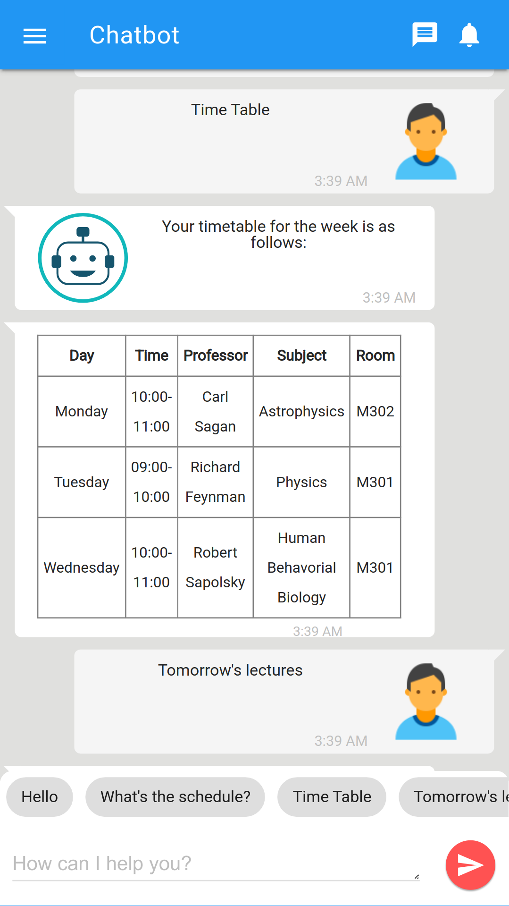
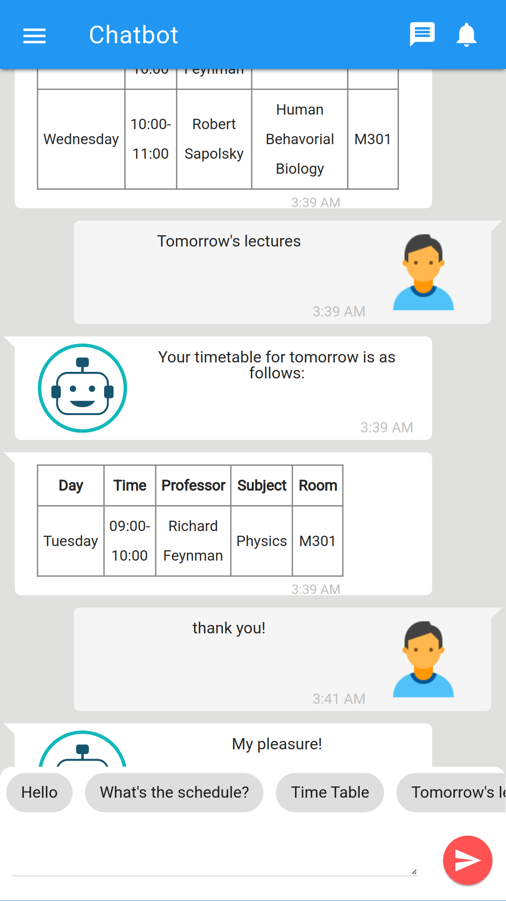
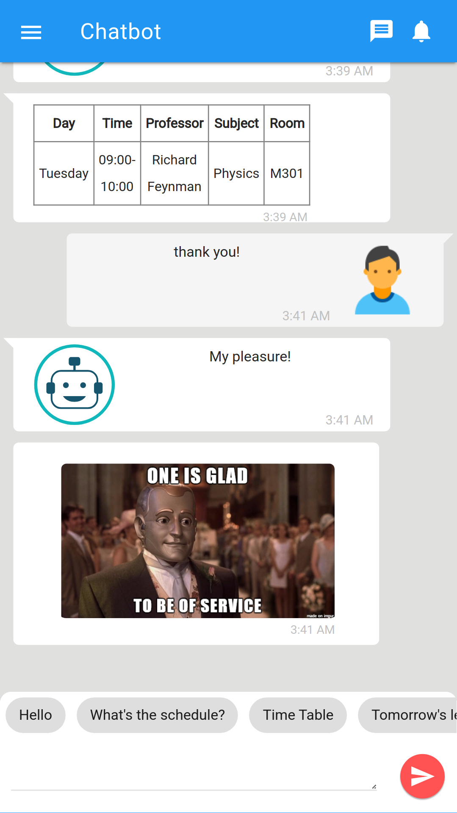
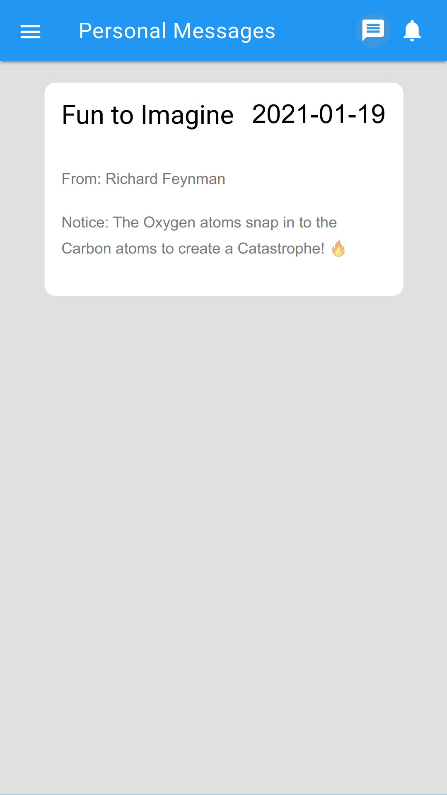
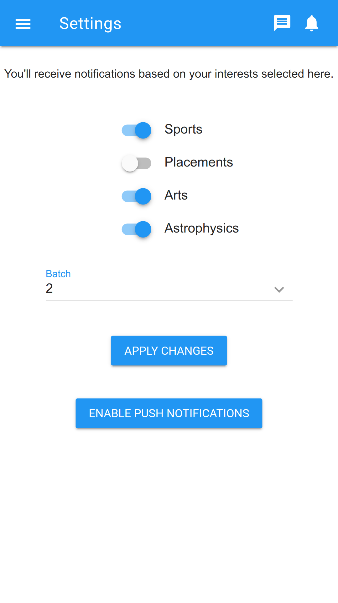

# Virtual Assistant for Students (Chatbot) - Frontend

<p align="center">

</p>

A chatbot for students to get info related to exam results, time table, etc.

This is the client side Single Page Application for [the chatbot server](https://github.com/shubhamnh/vas-chatbot-server/)

## Screenshots

<p align="center">
    
    
    
    
    
</p>

## Installation

Requirements:

* `git`
* `nodejs` & `npm`

Clone this repo and install dependencies. 

```bash
git clone https://github.com/shubhamnh/vas-chatbot-client.git
cd vas-chatbot-client
npm install
```
Change configuration in `config/dev.env.js` & `config/prod.env.js.example` as per requirements and rename `prod.env.js.example` => `prod.env.js`.

Run development server:

```bash
npm run dev
```